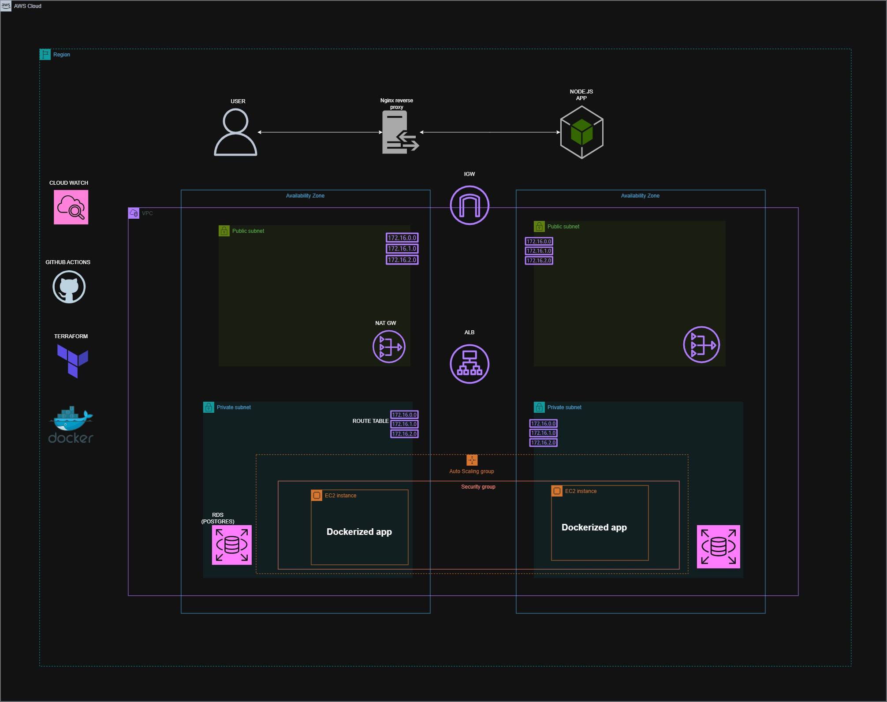

# AWS Inventory Management System

A full-stack Inventory Management System designed to streamline inventory tracking and management. The application provides essential CRUD (Create, Read, Update, Delete) operations for managing inventory records efficiently.

---

## 📋 Table of Contents

- [Overview](#overview)
- [Architecture](#architecture)
- [Tech Stack](#tech-stack)
- [Features](#features)
- [Infrastructure](#infrastructure)
- [Getting Started](#getting-started)
- [CI/CD Pipeline](#cicd-pipeline)
- [Project Structure](#project-structure)
- [Documentation](#documentation)

---

## Overview

This project demonstrates a production-ready full-stack application with:
- **Frontend**: Modern, responsive React TypeScript interface
- **Backend**: Scalable Node.js/Express RESTful API
- **Database**: PostgreSQL for persistent data storage
- **Infrastructure**: AWS with Terraform Infrastructure-as-Code
- **Containerization**: Docker for consistency and portability
- **Reverse Proxy**: NGINX for security and request routing

---

## 🏗️ Architecture



### System Design

The application follows a three-tier architecture:

1. **Frontend Layer** (React + TypeScript)
   - Responsive user interface for inventory management
   - Real-time data updates via RESTful API calls
   - Built for modern browsers with TypeScript type safety

2. **API Layer** (Node.js + Express)
   - RESTful endpoints for CRUD operations
   - Request validation and error handling
   - Authentication and authorization logic

3. **Data Layer** (PostgreSQL)
   - Persistent data storage
   - ACID compliance for data integrity
   - Optimized queries for performance

### Network Architecture

```
┌─────────────────────────────────────────────────┐
│              AWS Cloud                          │
│  ┌───────────────────────────────────────────┐  │
│  │  Application Load Balancer (ALB)          │  │
│  └──────────────────┬──────────────────────┘  │
│                     │                          │
│  ┌──────────────────▼──────────────────────┐  │
│  │  Auto Scaling Group (EC2 Instances)     │  │
│  │  ┌──────────────────────────────────┐   │  │
│  │  │  NGINX Reverse Proxy             │   │  │
│  │  │  ┌────────────────────────────┐  │   │  │
│  │  │  │  Frontend (React)          │  │   │  │
│  │  │  │  Backend (Node.js/Express) │  │   │  │
│  │  │  └────────────────────────────┘  │   │  │
│  │  └──────────────────┬───────────────┘   │  │
│  └─────────────────────┼──────────────────┘  │
│                        │                      │
│  ┌─────────────────────▼──────────────────┐  │
│  │  Amazon RDS PostgreSQL (Encrypted)     │  │
│  └────────────────────────────────────────┘  │
└─────────────────────────────────────────────────┘
```

**Key Features:**
- Application runs on EC2 instances in a private subnet (no public IP)
- AWS Application Load Balancer (ALB) for traffic distribution
- Auto Scaling for handling variable load
- Encrypted Amazon RDS PostgreSQL database
- All infrastructure managed through Terraform

---

## 🛠️ Tech Stack

| Component | Technology | Purpose |
|-----------|-----------|---------|
| **Frontend** | React, TypeScript | Modern UI with type safety |
| **Backend** | Node.js, Express.js | Scalable API server |
| **Database** | PostgreSQL | Reliable data persistence |
| **Web Server** | NGINX | Reverse proxy & security layer |
| **Containerization** | Docker | Consistent deployment |
| **Infrastructure** | AWS + Terraform | Cloud deployment & IaC |
| **CI/CD** | GitHub Actions | Automated build & deploy |

---

## ✨ Features

- ✅ Inventory item management
- ✅ Full CRUD operations (Create, Read, Update, Delete)
- ✅ RESTful API with TypeScript backend
- ✅ PostgreSQL database connectivity
- ✅ Product search and filtering
- ✅ Category management
- ✅ Low-stock alerts
- ✅ Secure request routing with NGINX
- ✅ Dockerized deployment for scalability
- ✅ Auto-scaling on AWS
- ✅ Automated CI/CD pipeline

---

## 🚀 Infrastructure

**Infrastructure as Code Repository:**
➡️ **[Tladi95/AWS-IMS-Terraform-code](https://github.com/Tladi95/AWS-IMS-Terraform-code)**

The application infrastructure is defined and provisioned using Terraform in a dedicated repository. This separation of concerns allows:

- **Application Code** (this repo): Focuses on business logic and features
- **Infrastructure Code**: Handles AWS resources, networking, and scaling

### Infrastructure Components

The Terraform repository manages:
- VPC and subnet configuration
- EC2 Auto Scaling Groups
- AWS Application Load Balancer (ALB)
- Amazon RDS PostgreSQL database
- Security Groups and IAM roles
- OIDC federated authentication for CI/CD
- Monitoring and logging setup
- Cost optimization strategies

**Full Documentation:** See the [AWS-IMS-Terraform-code](https://github.com/Tladi95/AWS-IMS-Terraform-code) repository for:
- Complete AWS architecture diagram
- Security design details
- Scaling strategy
- Monitoring setup
- Cost breakdown

---

## 🏃 Getting Started

### Prerequisites

- **Node.js** 16+ (for local development)
- **PostgreSQL** 12+ (for local development)
- **Docker** & **Docker Compose** (for containerized development)
- **AWS Account** (for deployment)

### Local Development Setup

#### 1. Clone the Repository

```bash
git clone https://github.com/Tladi95/AWS-Inventory-managment-system.git
cd AWS-Inventory-managment-system
```

#### 2. Backend Setup

See [backend/README.md](./backend/README.md) for detailed setup instructions.

```bash
cd backend
npm install
cp .env.example .env
# Update .env with your PostgreSQL connection
npm run db:migrate
npm run dev
```

#### 3. Frontend Setup

See [frontend/README.md](./frontend/README.md) for detailed setup instructions.

```bash
cd frontend
npm install
npm start
```

#### 4. Using Docker

```bash
# Build images
docker-compose build

# Start services
docker-compose up

# Frontend: http://localhost:3000
# Backend: http://localhost:3001
```

---

## 🔄 CI/CD Pipeline

Automated deployment is handled by GitHub Actions. On every push to `main`:

1. **Build Phase**
   - Builds frontend Docker image
   - Builds backend Docker image
   - Runs tests and linting

2. **Push Phase**
   - Pushes images to Docker Hub

3. **Deploy Phase**
   - Authenticates to AWS using OIDC (no stored credentials)
   - Connects securely to EC2 instance(s)
   - Pulls latest images
   - Restarts containers

**Workflow File:** [.github/workflows/deploy.yml](./.github/workflows/deploy.yml)

### Key Security Features

- ✅ **OIDC Federated Authentication**: Short-lived credentials, no stored access keys
- ✅ **Secure EC2 Connection**: Uses temporary credentials
- ✅ **Encrypted Secrets**: Sensitive data stored as GitHub Secrets
- ✅ **Automated Testing**: Pipeline includes validation before deployment

---

## 📁 Project Structure

```
AWS-Inventory-managment-system/
├── frontend/                          # React TypeScript Frontend
│   ├── src/
│   │   ├── components/               # Reusable UI components
│   │   ├── pages/                    # Page components
│   │   ├── services/                 # API service layer
│   │   └── App.tsx                   # Root component
│   ├── package.json
│   └── README.md
│
├── backend/                           # Node.js/Express Backend
│   ├── src/
│   │   ├── routes/                   # API endpoints
│   │   ├── controllers/              # Business logic
│   │   ├── models/                   # Database models
│   │   ├── middleware/               # Custom middleware
│   │   └── index.ts                  # Server entry point
│   ├── migrations/                   # Database migrations
│   ├── package.json
│   └── README.md
│
├── docker-compose.yml                 # Local development orchestration
├── Dockerfile                         # Multi-stage Docker image
├── CRUD-app-ARCHITECTURE.jpg         # Architecture diagram
├── README.md                          # This file
└── .github/
    └── workflows/
        └── deploy.yml                # CI/CD Pipeline

```

---

## 📖 Documentation

- **[Backend Documentation](./backend/README.md)** - API endpoints, setup, and database schema
- **[Frontend Documentation](./frontend/README.md)** - UI components, state management, and local setup
- **[Infrastructure Documentation](https://github.com/Tladi95/AWS-IMS-Terraform-code)** - AWS architecture, security, and deployment

### API Endpoints (Backend)

**Products Endpoints:**
- `GET /api/products` - Get all products
- `GET /api/products/:id` - Get product by ID
- `POST /api/products` - Create product
- `PUT /api/products/:id` - Update product
- `DELETE /api/products/:id` - Delete product
- `GET /api/products/search/:query` - Search products
- `GET /api/products/category/:category` - Filter by category
- `GET /api/products/categories/all` - Get all categories
- `GET /api/products/low-stock/:threshold` - Get low stock products

See [backend/README.md](./backend/README.md) for full API documentation.

---

## 🔐 Security

- **Network Security**: Private subnet with no direct public access
- **Encryption**: RDS database encryption at rest
- **API Security**: NGINX reverse proxy with request validation
- **CI/CD Security**: OIDC federated authentication, no hardcoded credentials
- **Code Security**: Input validation, error handling, and secure configurations

---

## 📊 Monitoring & Logging

Infrastructure monitoring and logging are configured in the Terraform repository:
- CloudWatch for application logs
- CloudWatch metrics for performance monitoring
- Auto-scaling based on CPU utilization
- Health checks on load balancer

---

## 🤝 Contributing

1. Create a feature branch (`git checkout -b feature/AmazingFeature`)
2. Commit changes (`git commit -m 'Add AmazingFeature'`)
3. Push to branch (`git push origin feature/AmazingFeature`)
4. Open a Pull Request

---

## 📝 License

This project is licensed under the MIT License - see the LICENSE file for details.

---

## 📞 Support

For questions or issues:
- Open an issue on [GitHub Issues](https://github.com/Tladi95/AWS-Inventory-managment-system/issues)
- Check existing documentation in backend and frontend README files
- Review the [AWS-IMS-Terraform-code](https://github.com/Tladi95/AWS-IMS-Terraform-code) for infrastructure-related questions

---

## 🚦 Quick Links

- **Application Repository**: https://github.com/Tladi95/AWS-Inventory-managment-system
- **Infrastructure Repository**: https://github.com/Tladi95/AWS-IMS-Terraform-code
- **Backend Setup**: [backend/README.md](./backend/README.md)
- **Frontend Setup**: [frontend/README.md](./frontend/README.md)
- **CI/CD Pipeline**: [.github/workflows/deploy.yml](./.github/workflows/deploy.yml)
